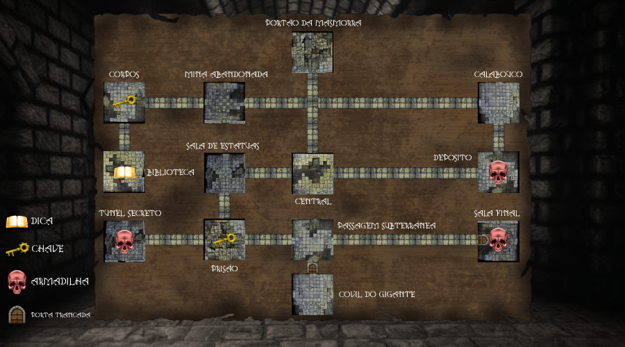

# Dungeon Seeker

---

## Mapa do jogo

## Descrição do jogo

O Jogador se encontra numa masmorra em busca de um tesouro, 
seu objetivo consiste em navegar pelas salas e descobrir onde se encontra o 
tesouro, porém há impecilhos como portas trancadas que necessitam de chaves e 
armadilhas mortais.

## Adições:

| Implementação |                                                                                                                               Descrição                                                                                                                               |
|:-------------:|:---------------------------------------------------------------------------------------------------------------------------------------------------------------------------------------------------------------------------------------------------------------------:|
|    Chaves     | Foi criado uma classe com o nome de "game.Player", essa classe tem um Array de Strings que representam chaves que o jogador obteve, com métodos para adição e checagem das chaves, além de implentar na classe game.Room o atributo de haver chaves e estar trancada. |
|  Armadilhas   |                                                                                            Por meio da interação checa se a sala tem uma armadilha, se houver, Game Over.                                                                                             |
|     Dicas     |                                                                                                             Na interação, caso haja dica, ela é mostrada.                                                                                                             |
|     Final     |                                                                                               O objetivo do jogo é finalizado ao chegar na sala secreta com o tesouro.                                                                                                |

> Para iniciar, só rodar a classe game.play.Play
>
> Projeto retirado do livro Objects First with Java: A Practical Introduction using BlueJ